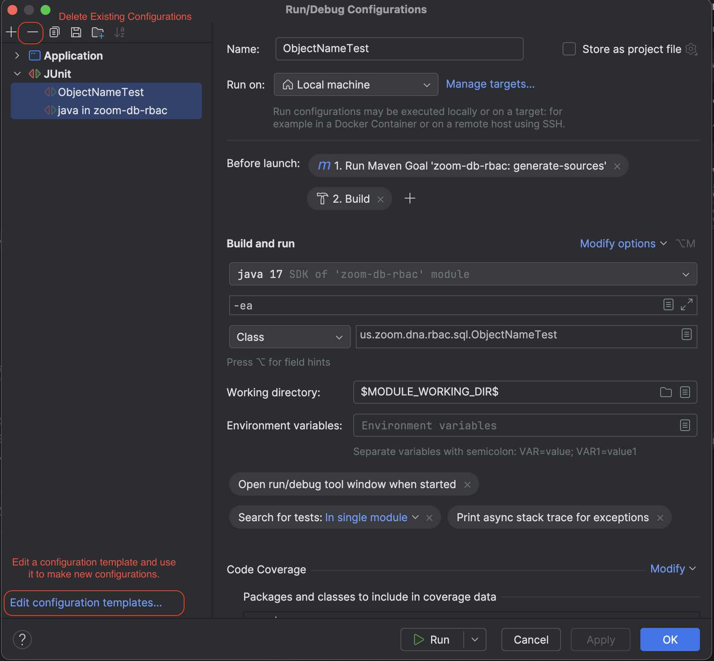

# Contributing

We need contributors for Data Fence!

Please follow this guide if you plan to contribute code to this project.

[[_TOC_]]

## What We Need Help With

While Data Fence works very well for Zoom's internal use cases, as we release this 
project open source, we expect that we will need help with making the tool into a more 
broadly useful tool.  At the same time we plan to keep the tool focused on doing one 
specific task very well instead of becoming a general purpose security tool. Categories 
which we need help with include the following.

1. Add support for generation of a native executable.
2. Improve documentation. Add a wiki.
3. Snowflake is constantly coming out with new grant types which often use different 
syntax to parse and manage. This is a continuous maintenance task.
4. Add support for additional providers and a corresponding plugin architecture.

## Tool Chain Setup

Use the following steps to setup the local tool chain.

### Maven

This project uses [Apache Maven](https://maven.apache.org/). Ensure that Maven is
installed and functional.

### Java

This project uses OpenJDK 17 at this time. Ensure that you are using the correct Java
version. On MacOS, [homebrew](https://brew.sh/) is useful for installing Java versions.

#### Setting Java Version For the Command Line

The easiest way to manage java versions for the command line is
with [jenv](https://github.com/jenv/jenv).

#### Setting Jave Version for IntelliJ

Set the Java version for IntelliJ using
the [project structure settings.](https://www.jetbrains.com/help/idea/sdk.html).

### Docker

In order to test the docker build, you must install Docker. Docker is available with a
license from People Hub (ServiceNow/Happy Desk). Podman may also be used. However, the
build system uses Docker so when troubleshooting Docker is preferable for replicating the
build system.

### Antlr4 Parsers

Parts of the code are generated using [Antlr4](https://www.antlr.org/). Antlr is a
language lexer used for defining grammars for parsing languages such as Snowflake's
bizarre and inconsistent syntax for identifiers. Antlr4 is configured using grammar files
ending in `*.g4` in the [src/main/antlr4](./src/main/antlr4) directory. The source files
are placed in the same class path that the generated classes will be created in. Antlr
generates source code files which you can then reference in the code.

The code generation is accomplished by the Maven `generate-sources` lifecycle phase, which
is included in the `package` phase. The generate sources are placed in
the [target/generated-sources/antlr4](./target/generated-sources/antlr4)
directory by the
[Maven Antlr4 Plugin](https://www.antlr.org/api/maven-plugin/latest/usage.html). Generated
sources should never be committed to the codebase or directly modified.

#### Antlr4 CLI Installation

Antlr4 CLI tools are not strictly required for building and running the project. However,
if you plan to work with the Antlr4 grammar files or the classes which use the Antlr4
generated code, the Antlr4 CLI tools are helpful.

Install Antlr4 globally in an environment neutral way using pipx as follows.

```shell
pipx install antlr4-tools
```

antlr4 is actually a java tool. However, the python wrapper adds a command line
convenience function.

See the [Antlr4 documentation](https://www.antlr.org/) for details.

#### Antlr4 Code Generation

Antlr4 will automatically generate the source files and place them in the target directory
during the generate-sources phase. This will create generated sources which can be
referenced by the application but which should not be modified.

If you are having trouble with the generated sources not updating or being created when
your IDE compiles the package, manually run maven. This will generate the sources in the
target directory. Note that you will need to run this command any time one of the grammar
files is changed and during first compile.

```shell
mvn generate-sources
```

#### Antlr4 Integration With IntelliJ

Follow these steps in order to integrate Antlr4 with IntelliJ. Similar steps may be needed
for other editors.

##### Install the Antlr4 Plugin

The [Antlr4 Plugin](https://plugins.jetbrains.com/plugin/7358-antlr-v4) will help with
syntax for grammar files. Install the plugin within IntelliJ.

##### Fix Missing Generated Sources in IntelliJ by Configure The IDE to Use Maven For Build

The default build configuration will not run the "generate-sources" maven lifecycle phase.

You can manage this by running `mvn generate-sources` yourself in the CLI. However, this
can get confusing when you forget to run it and you wonder why your tests are failing or
the tests succeeded when they should have failed because you changed somethings.

IntelliJ should fix this. However, it has been a known issue for years
([IDEA-311896](https://youtrack.jetbrains.com/issue/IDEA-311896/automatically-run-generate-sources-before-build), [IDEA-225223](https://youtrack.jetbrains.com/issue/IDEA-225223/Maven-Generate-source-and-update-folders-before-build))
so they probably will not. Queue Eclipse users saying "I told you so." Here are a couple
of the less clunky workarounds.

###### Option 1: Use Maven For All Builds in IDE

You can tell IntelliJ to use Maven to build the package instead of it's built in method.
This does lead to the most consistent experience since it affects the build step globally
for the entire IDE. However, this solution will slow down every build because it is not
using IntelliJ's built in built optimization. This includes If you every time you run a
test case. If you iterate quickly and suffer from impatience, this solution may not be for
you.


Set
**Build, Execution, Deployment >> Build Tools >> Maven >> Runner >> Delegate IDE Build/Run
Actions to Maven**. This will cause the IDE to use maven just like if you ran maven in the
command line.

In addition, in order to avoid unnecessarily running tests on every build select
**Build, Execution, Deployment >> Build Tools >> Maven >> Runner >> Skip Tests**
Otherwise, when you run tests through the IDE it will run tests once through the build and
once through the IDE. Test failures will occur first during build but will not show all of
the helpful context that a test run by the IDE shows.

In order to confirm if the IDE is building the generated sources correctly, perform the
following.

1. Remove the [target](./target) directory if it exists.
2. Run the build step with the IDE.
3. Confirm that the [target/generated-sources/antlr4](./target/generated-sources/antlr4)
   directory exists. If it did not, it probably failed during the build step anyway due to
   missing packages.

###### Option 2: Pre-Build Step in Run Configuration

You can set up IntelliJ to add a Maven pre-build step in the run configurations. This is
more performant than letting IntelliJ use Maven for the entire build. However, it can be
more difficult to manage because it is set on a per-configuration basis and it does not
affect the build button itself. You may find yourself confused why something is not
working only to realize that the specific run configuration for a test case you are
running does not have the pre-build configuration turned on or that the test case got
destroyed and recreated and lost it's configuration.


You can make this a little less painful by deleting all existing run configurations and
settings the change using a template instead. However, if you have a template for Junit
and a template for running the application, you need to change it in both.



We have placed a couple default run configuration templates in version control in the
[run](./run) directory to see if this helps make it easier to provide a consistent
experience. Normally we don't commit IDE configurations to version control. However, we
will try it out for this case.

## Local Build

This package generates both a Java jar build output and a docker image. The artifacts can
be built locally for testing as follows.

### Java Jar Build

Use [Apache Maven](https://maven.apache.org/) to build the jar files in the
[target](./target) directory.

```shell
mvn package
```

### Docker Build

```shell
 docker  build .
```


