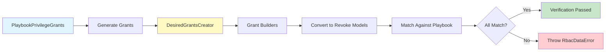

# Consistency Package Flow

## Overview

The consistency package verifies that grants generated by the grant creation path match the playbook grants used by the revoke path.

1. **Conversion**: Converts playbook privilege grants to revoke path models
2. **Generation**: Uses grant creator to generate grants (same path as grant creation)
3. **Verification**: Converts generated grants to revoke models and matches them against original playbook grants
4. **Error Detection**: Throws `RbacDataError` if any generated grant doesn't match its source playbook grant
5. **Purpose**: Ensures grant creation and revoke logic stay in sync

