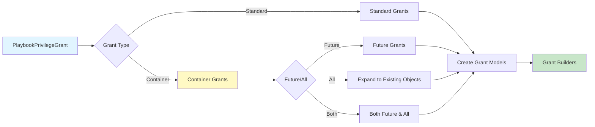

# Grant Create Package Flow

## Overview

The grant.create package generates desired grants from playbook privilege grants.

1. **Standard Grants**: Direct grants on specific objects (validates and qualifies object names)
2. **Container Grants**: Grants on containers (database/schema) that expand to:
   - **Future Grants**: Grants on future objects using `<OBJECT_TYPE>` syntax
   - **All Grants**: Grants expanded to all existing objects in the container
3. **Object Service**: Queries Snowflake to discover existing objects for expansion
4. **Builder Conversion**: Converts grant models to grant builders for statement generation

