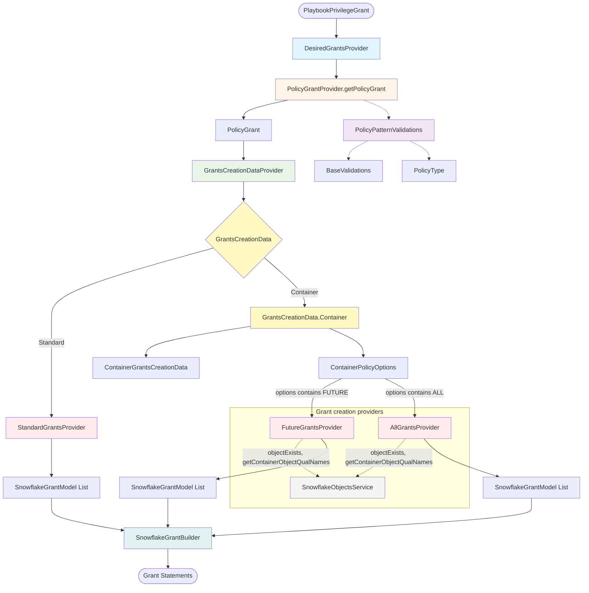

# Grant Desired Create Architecture

This diagram illustrates the architecture and flow of the `grant.desired.create` package, which handles the conversion of playbook grants to Snowflake grant statements.

## Overview

The grant creation system is responsible for:
1. Validating playbook grant patterns
2. Resolving patterns to specific grant types (standard, future, or all)
3. Creating appropriate Snowflake grant models
4. Building executable grant statements

## Architecture Diagram



**Flow note:** Validation (PolicyPatternValidations, BaseValidations) runs inside `PolicyGrantProvider.getPolicyGrant` when building `PolicyGrant`; `PolicyType` is produced via `PolicyTypeProvider` and stored on `PolicyGrant`. `GrantsCreationDataProvider.getGrantsCreationData(grant.policyType(), grant, roleName)` returns either `GrantsCreationData.Standard` or `GrantsCreationData.Container`. For Container, `DesiredGrantsProvider` iterates over `containerPolicyOptions().options()` (each a `ContainerPolicyOption`: FUTURE or ALL) and calls `FutureGrantsProvider.createGrants(containerGrantsCreationData)` or `AllGrantsProvider.createGrants(containerGrantsCreationData)` with the inner `ContainerGrantsCreationData`.

## Component Descriptions

### Entry Point
- **DesiredGrantsProvider**: Main entry point that orchestrates the grant creation process

### Validation & Pattern Resolution
- **PolicyGrantProvider**: Converts `PlaybookPrivilegeGrant` to `PolicyGrant` with validation
- **PolicyPatternValidations**: Validates playbook patterns and resolves them to specific types
- **BaseValidations**: Performs basic validation on grant patterns
- **PolicyType**: Sealed interface representing resolved pattern types:
  - `Standard`: Sub-types (Global, AccountObject, AccountObjectDatabase, Schema, SchemaObject) for direct grants to specific objects.
  - `Container`: Sub-types (AccountObjectDatabase, Schema, SchemaObjectAllSchemas) for wildcard grants (future/all) on containers; each holds `ContainerPolicyOptions`.

### Data Preparation
- **GrantsCreationDataProvider**: Creates appropriate data structures for grant creation from a `PolicyType`, `PolicyGrant`, and role name.
- **GrantsCreationData**: Sealed interface with two variants:
  - `Standard`: For direct object grants; passed to `StandardGrantsProvider.createGrants(GrantsCreationData.Standard)`.
  - `Container`: Wraps `ContainerGrantsCreationData` and `ContainerPolicyOptions`; used for future/all container grants.
- **ContainerGrantsCreationData**: Record passed to `FutureGrantsProvider` and `AllGrantsProvider`. Fields: `objectType`, `containerObjectType`, `normalizedObjectName`, `isSchemaObjectWithAllSchemas`, `privileges`, `roleName`.
- **ContainerPolicyOptions**: Record holding `List<ContainerPolicyOption> options`, built via `ContainerPolicyOptions.of(ContainerPolicyOption...)`. DesiredGrantsProvider iterates over `options()` and invokes FGP or AGP per option.
- **ContainerPolicyOption**: Enum with `FUTURE` and `ALL`. “Future and all” is represented by options containing both (e.g. `ContainerPolicyOptions.of(ALL, FUTURE)`).

### Grant Creation
- **StandardGrantsProvider**: Creates grants for specific named objects; accepts `GrantsCreationData.Standard`. Does not call SnowflakeObjectsService.
- **FutureGrantsProvider**: Accepts `ContainerGrantsCreationData`. Creates future grants using `<OBJECT_TYPE>` syntax. When `ContainerGrantsCreationData.isSchemaObjectWithAllSchemas` is true (e.g. `view.*.*.db`), also creates per-schema future grants when the database exists. **Calls SnowflakeObjectsService**: `objectExists(databaseName, DATABASE)` and `getContainerObjectQualNames(DATABASE, SCHEMA, databaseName)` to discover schemas when creating per-schema future grants.
- **AllGrantsProvider**: Accepts `ContainerGrantsCreationData`. Expands wildcard grants to all existing objects in a container; skips expansion when the container does not exist. **Calls SnowflakeObjectsService**: `objectExists(containerName, containerObjectType)` to check container existence, and `getContainerObjectQualNames(containerObjectType, objectType, containerName)` to list child objects to grant on.
- **SnowflakeObjectsService**: Information-schema service used by FutureGrantsProvider and AllGrantsProvider. Supplied by DesiredGrantsProvider’s constructor and passed into FGP and AGP. Provides `objectExists` and `getContainerObjectQualNames` for existence checks and container expansion.

### Output
- **SnowflakeGrantModel**: Immutable model representing a single grant
- **SnowflakeGrantBuilder**: Converts models to executable SQL statements

## Flow Examples

### Example 1: Standard Grant
```
Input: table.my_table.my_schema.my_db [SELECT]
↓
PolicyGrant → Standard Pattern
↓
GrantsCreationData.Standard
↓
StandardGrantsProvider
↓
Output: GRANT SELECT ON TABLE "MY_DB"."MY_SCHEMA"."MY_TABLE" TO ROLE ROLE_NAME;
```

### Example 2: Future Grant
```
Input: table.*.*.my_db [SELECT] (future=true)
↓
PolicyGrant → PolicyType.Container (options: FUTURE)
↓
GrantsCreationData.Container(ContainerGrantsCreationData, ContainerPolicyOptions.of(FUTURE))
↓
FutureGrantsProvider.createGrants(ContainerGrantsCreationData)
↓
Output: GRANT SELECT ON FUTURE TABLES IN DATABASE "MY_DB" TO ROLE ROLE_NAME;
```

### Example 3: All Grant
```
Input: table.*.my_schema.my_db [SELECT] (includeAll=true)
↓
PolicyGrant → PolicyType.Container (options: ALL)
↓
GrantsCreationData.Container(ContainerGrantsCreationData, ContainerPolicyOptions.of(ALL))
↓
AllGrantsProvider.createGrants(ContainerGrantsCreationData) → Queries existing tables
↓
Output: Multiple grants for each existing table in the schema
```

### Example 4: Future and All Grant
```
Input: table.*.*.my_db [SELECT] (future=true, includeAll=true)
↓
PolicyGrant → PolicyType.Container (options: ALL, FUTURE)
↓
GrantsCreationData.Container(ContainerGrantsCreationData, ContainerPolicyOptions.of(ALL, FUTURE))
↓
DesiredGrantsProvider iterates options: FutureGrantsProvider + AllGrantsProvider (each receives same ContainerGrantsCreationData)
↓
Output: Future grant + grants for all existing tables
```

## Key Design Principles

1. **Separation of Concerns**: Each provider has a single responsibility
2. **Immutability**: Data models are immutable records
3. **Type Safety**: Sealed interfaces ensure exhaustive pattern matching
4. **Validation First**: Patterns are validated before grant creation
5. **Fail Fast**: Errors are caught early in the validation phase
6. **Testability**: Each component can be tested independently

## Related Classes

### Models
- `PolicyGrant`: Validated playbook grant with resolved pattern
- `PolicyPatternOptions`: Options for pattern resolution (e.g. future, includeAll)
- `GrantPrivilege`: Privilege information with validation
- `GrantsCreationData.Standard`: Direct grant data (objectType, normalizedObjectName, privileges, roleName)
- `GrantsCreationData.Container`: Wraps `ContainerGrantsCreationData` and `ContainerPolicyOptions`
- `ContainerGrantsCreationData`: Container grant data passed to FutureGrantsProvider and AllGrantsProvider
- `ContainerPolicyOptions`: Record holding `List<ContainerPolicyOption> options`, built via `of(ContainerPolicyOption...)`
- `ContainerPolicyOption`: Enum `FUTURE`, `ALL`

### Companions
- `PolicyGrantProvider`: Factory and validation for PolicyGrant
- `PolicyTypeProvider`: Pattern resolution to PolicyType

### Utilities
- `PolicyWildcards`: Constants and utilities for wildcard handling
- `ObjectName`: Snowflake object name normalization

### Services (called by grant creation)
- `SnowflakeObjectsService`: Injected into DesiredGrantsProvider and passed to FutureGrantsProvider and AllGrantsProvider. Called by FGP (objectExists, getContainerObjectQualNames for per-schema future grants) and AGP (objectExists, getContainerObjectQualNames for container expansion).

## Testing Strategy

Each component has dedicated tests:
- `DesiredGrantsProviderTest`: Integration tests for the main flow
- `StandardGrantsProviderTest`: Unit tests for standard grants
- `FutureGrantsProviderTest`: Unit tests for future grants
- `AllGrantsProviderTest`: Unit tests for all grants
- `PolicyPatternValidationsTest`: Validation logic tests
- `BaseValidationsTest`: Base validation (e.g. liftError) tests
- `PolicyTypeProviderTest`: Pattern resolution to `PolicyType` tests
- `PolicyGrantProviderTest`: Companion logic tests
