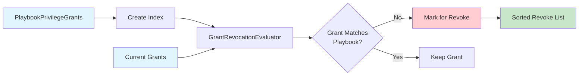

# Revoke Package Flow

## Overview

The revoke package identifies which existing grants should be revoked by comparing current grants against playbook grants.

1. **Index Creation**: Playbook grants are indexed by object type and privilege for efficient lookup
2. **Evaluation**: Each current grant is evaluated to determine if it matches any playbook grant
3. **Matching**: Grants that don't match any playbook grant are marked for revocation
4. **Output**: Returns sorted list of grant builders to revoke

